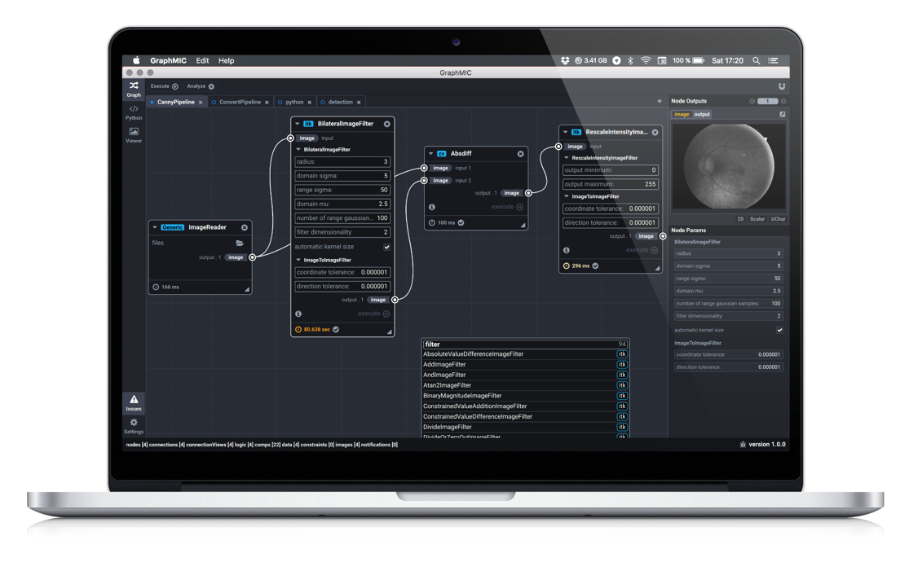
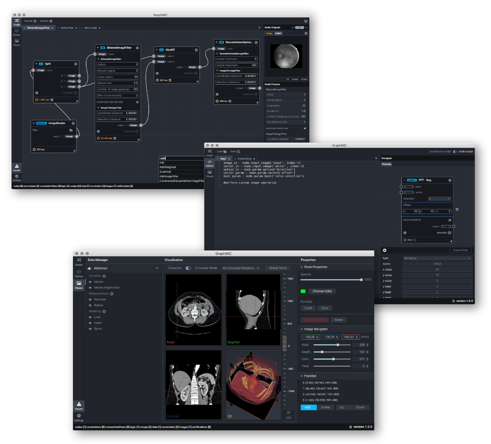
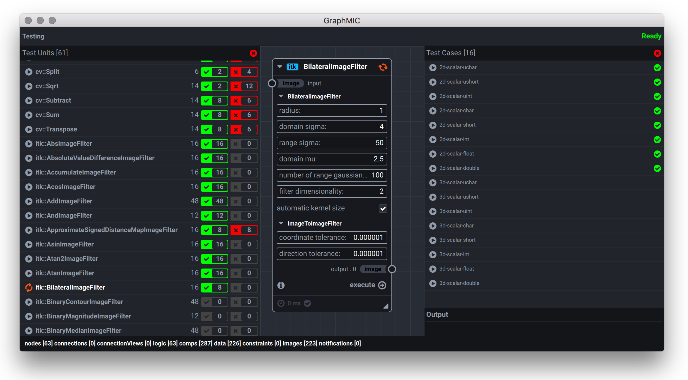
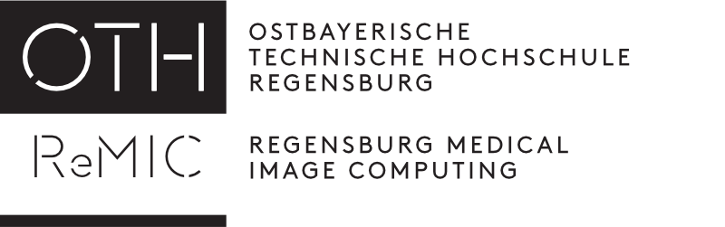

	<h1 style="color: #437ABE">GraphMIC</h1>
	<b style="color: #437ABE">Graph</b> Based	<b style="color: #437ABE">M</b>edical	<b style="color: #437ABE">I</b>mage
	<b style="color: #437ABE">C</b>omputing

GraphMIC provides a node based interface for **[ITK](https://itk.org)** and **[OpenCV](http://opencv.org)** operations and allows simple creation of complex image processing pipelines without programming. Various high-level features like built-in 2D and 3D data visualization based on **[VTK](http://www.vtk.org)** and an integrated **[Python](https://www.python.org)** Interpreter aim to support typical workflows.

**
Detailed Build-Instructions will be available soon!
**

Features
----
### Visual Image Processing
Compared to source code, the visual representation allows a much quicker understanding of the structure and parameters of image processing pipelines. Interactive UI components allow adjustments like rearranging the operation sequence or manipulating parameters. By providing simplified and powerful workflows, GraphMIC is best suited for easy prototyping and experimental development of image processing pipelines.

### Fast OpenCV and ITK using C++
Utilizing the data abstraction layer from the **[MITK](http://mitk.org/)** library, operations from **[ITK](https://itk.org)** and **[OpenCV](http://opencv.org)** can be combined in a pipeline. Since the application is written in C/C++, invocation of specific library calls are executed with no additional overhead.

### Python Interpreter
The embedded python interpreter allows cration of custom nodes. After defining a set of parameters and the operation logic, custom nodes can be seamlessly integrated into a pipeline. GraphMIC has out of the box support for **[NumPy](http://www.numpy.org)**, **[SimpleITK](http://www.simpleitk.org)** and python bindings to **[OpenCV](http://opencv.org)** and **[VTK](http://www.vtk.org)**.

### Built-In Visualization
An integrated image viewer based on **[MITK](http://mitk.org/)** makes it possible to easily access features like CPU/GPU volume rendering and interaction processing for ROIs, seed points and annotations.

### Automated Testing
GraphMIC provides a separated testing variant of the executable application in order to test different image processing operations. A JSON configuration is used to define a test unit with different test cases, where each test case can specify a different set of parameters and image types. GraphMIC also contains a set of built-in test images to use for different test scenarios.

	

### And Many Other Features
- Cross Platform
- Image Sequence Processing
- Multi Threading Support
- Error Handling
- Modern UI based on **[Qt](http://qt-project.org)**/**[QML](http://doc.qt.io/qt-5/qtqml-index.html)**

Current Development Status
----
This software is in an early state of development. Since the initial commit can be considered as just a transfer of our private repository to GitHub, we still have to do a lot of work to achieve a stable state. 

### version 0.8

- Windows Support
- Constraint System
- Bug Fixes

### version 0.9

- Documentation
- Prebuilt Binaries

Contributing
----
Contributions are welcome! 

We will try to provide relevant developer documentation as soon as possible! 

Acknowledgements
----
This software was developed in collaboration with [OTH Regensburg](https://www.oth-regensburg.de/en.html) and [ReMIC](http://www.re-mic.de)

Contact
----

Send us a mail to <a href="mailto:info@graphmic.com">info@graphmic.com</a>

License
----

Copyright (c) 2014-2016, Alexander Eduard Szalo, Alexander Zehner
All rights reserved.

Redistribution and use in source and binary forms, with or without modification, are permitted provided that the following conditions are met:

1. Redistributions of source code must retain the above copyright notice, this list of conditions and the following disclaimer.

2. Redistributions in binary form must reproduce the above copyright notice, this list of conditions and the following disclaimer in the documentation and/or other materials provided with the distribution.

3. Neither the name of the copyright holder nor the names of its contributors may be used to endorse or promote products derived from this software without specific prior written permission.

THIS SOFTWARE IS PROVIDED BY THE COPYRIGHT HOLDERS AND CONTRIBUTORS "AS IS" AND ANY EXPRESS OR IMPLIED WARRANTIES, INCLUDING, BUT NOT LIMITED TO, THE IMPLIED WARRANTIES OF MERCHANTABILITY AND FITNESS FOR A PARTICULAR PURPOSE ARE DISCLAIMED. IN NO EVENT SHALL THE COPYRIGHT HOLDER OR CONTRIBUTORS BE LIABLE FOR ANY DIRECT, INDIRECT, INCIDENTAL, SPECIAL, EXEMPLARY, OR CONSEQUENTIAL DAMAGES (INCLUDING, BUT NOT LIMITED TO, PROCUREMENT OF SUBSTITUTE GOODS OR SERVICES; LOSS OF USE, DATA, OR PROFITS; OR BUSINESS INTERRUPTION) HOWEVER CAUSED AND ON ANY THEORY OF LIABILITY, WHETHER IN CONTRACT, STRICT LIABILITY, OR TORT (INCLUDING NEGLIGENCE OR OTHERWISE) ARISING IN ANY WAY OUT OF THE USE OF THIS SOFTWARE, EVEN IF ADVISED OF THE POSSIBILITY OF SUCH DAMAGE.